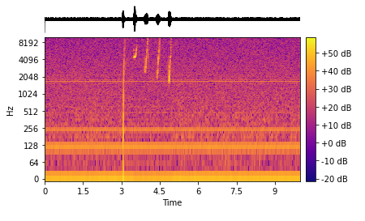

# ndx-sound Extension for NWB

NWB extension of sounds.

## Installation

```shell
pip install ndx-sound
```

## Usage

## Python

### Add to an NWB file
```python
from pynwb import NWBFile
from scipy.io import wavfile
from ndx_sound import AcousticWaveformSeries

sampling_rate, samples = wavfile.read(filepath)

acoustic_waveform_series = AcousticWaveformSeries(
    name="acoustic_stimulus",
    data=samples,
    rate=sampling_rate,
    description="acoustic stimulus",
)

nwbfile = NWBFile(...)
# if a recording of behavior, add to acquisition
nwbfile.add_acquisition(acoustic_waveform_series)

# if a stimulus, add to stimulus
nwbfile.add_stimulus(acoustic_waveform_series)
```

### Visualization

You can use the plotting function on its own outside nwbwidgets.
```python
from nwb_sound.widgets import plot_acoustic_waveform

plot_acoustic_waveform(nwbfile.stimulus["sound_stimulus1"])
```




You can also have the sound widget automatically loaded into `nwb2widget`.
```python
from ndx_sound import widgets
```
Then run `nwb2widget` as normal.
```python
from nwbwidgets import nwb2widget

nwb2widget(nwbfile)
```


---
This extension was created using [ndx-template](https://github.com/nwb-extensions/ndx-template).
